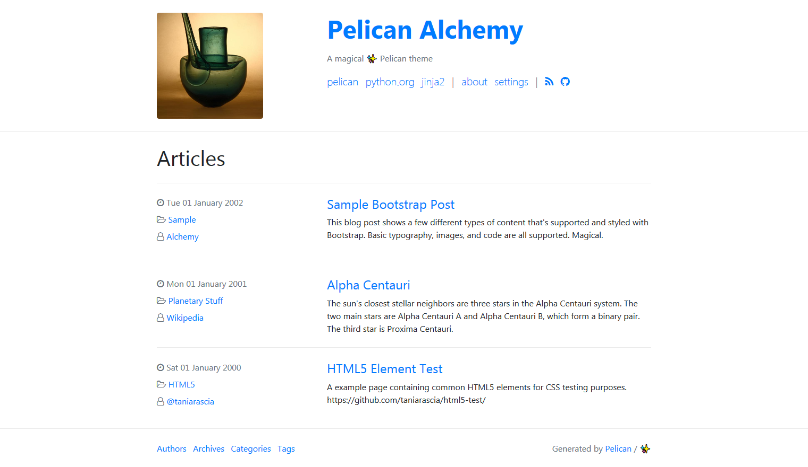
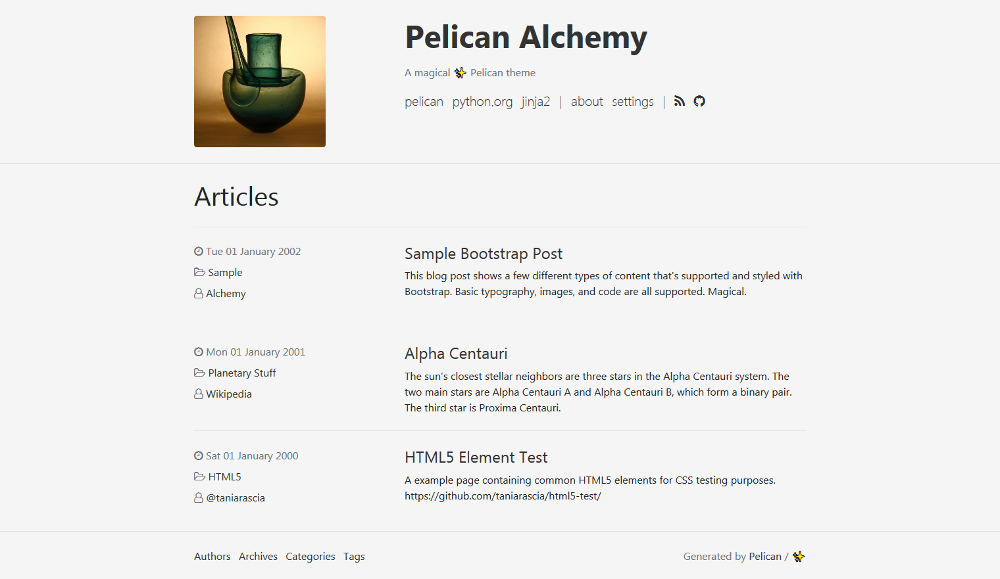
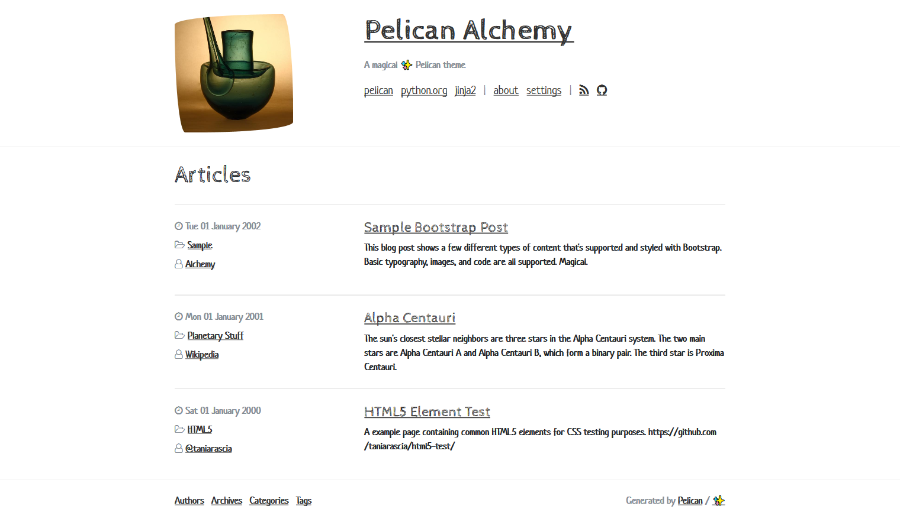
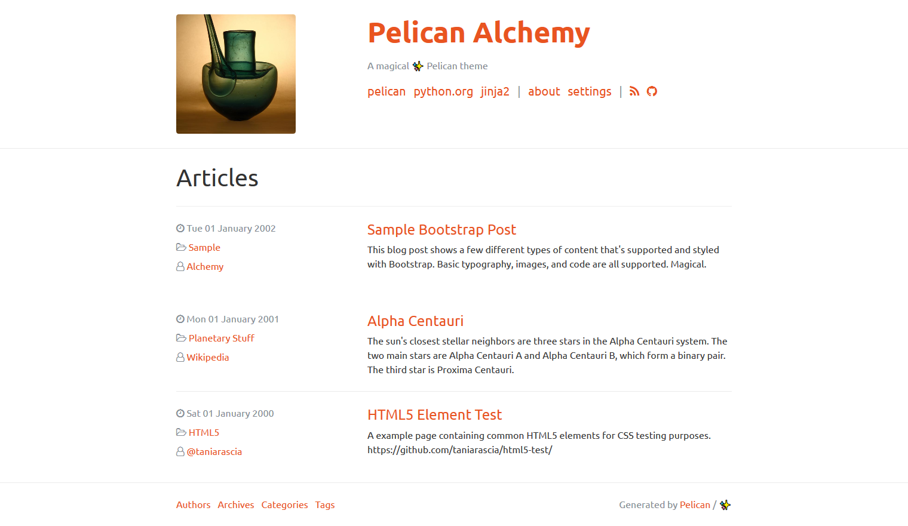

# Pelican Alchemy

> A magical ✨ Pelican theme

Alchemy is a functional, clean, responsive theme for the [Pelican](http://getpelican.com) static site generator.

Inspired by [crowsfoot](http://github.com/porterjamesj/crowsfoot) and [clean-blog](https://github.com/BlackrockDigital/startbootstrap-clean-blog), it features:

- Powered by [Bootstrap 4](https://getbootstrap.com/) (v4.3.1)
- Supports any [Boostwatch](https://bootswatch.com/) themes
- [Font Awesome](http://fontawesome.io/) icons
- [Pygments](http://pygments.org/) syntax highlighting styles
- Pelican `sitemap.xml` support
- [Favicon Generator](http://realfavicongenerator.net/) support
- External analytics ([Google](https://analytics.google.com), [Gauges](https://gaug.es), [Piwik](https://piwik.org)) support **
- External comments ([Disqus](https://disqus.com)) support **

** Features link to external assets (webfonts etc).

## Screenshots

<table>
<tr>
  <td colspan="2">
    <a href="screenshots/default.png">
      
      <p align="center">Default colors</p>
    </a>
  </td>
</tr>
<tr>
  <td>
    <a href="screenshots/oldstyle.png">
      
      <p align="center">Old style (see below)</p>
    </a>
  </td>
  <td>
    <a href="screenshots/sketchy.png">
      
      <p align="center">Sketchy (Boostwatch)</p>
    </a>
  </td>
</tr>
<tr>
  <td>
    <a href="screenshots/solar.png">
      
      <p align="center">Solar (Boostwatch)</p>
    </a>
  </td>
  <td>
    <a href="screenshots/united.png">
      
      <p align="center">United (Boostwatch)</p>
    </a>
  </td>
</tr>
</table>

> To enable old visual style add `THEME_CSS_OVERRIDES = ['theme/css/oldstyle.css']`
> to your `pelicanconf.py` and use no Boostwatch themes.
> See [stylesheet](alchemy/static/css/oldstyle.css) for more information.

## Installation

### From Git repo

Clone the repo:

```bash
git clone https://github.com/nairobilug/pelican-alchemy
```

Set the `THEME` variable in your Pelican config:

```python
THEME = '<PATH_TO_REPO>/alchemy'
```

### As a Submodule

In your Pelican site:

```bash
mkdir themes
git submodule add https://github.com/nairobilug/pelican-alchemy themes/pelican-alchemy
```

And in Pelican config:

```python
THEME = 'themes/pelican-alchemy/alchemy'
```

### With pip

Alternatively, you can install this theme with pip:

```bash
pip install "https://github.com/nairobilug/pelican-alchemy/tarball/master"
```

And import it from Pelican config:

```python
import alchemy
THEME = alchemy.path()
```

## Usage

Visit the [Settings wiki](https://github.com/nairobilug/pelican-alchemy/wiki/Settings) for examples:

- **SITESUBTITLE**: Subtitle that appears in the header.
- **SITEIMAGE**: Image that appears in the header.
- **DESCRIPTION**: Index HTML head `<meta>` description.
- **LINKS**: A list of tuples (Title, URL) for menu links.
- **ICONS**: A list of tuples (Icon, URL) for icon links.
- **BOOTSTRAP_CSS**: URL of Bootstrap CSS file. Use this to enable Boostwatch themes.
- **PYGMENTS_STYLE**: Built-in Pygments style for syntax highlighting.
- **HIDE_AUTHORS**: Hide the author(s) of an article - useful for single author sites.
- **RFG_FAVICONS**: Use a Favicon Generator package.
- **THEME_CSS_OVERRIDES**: Sequence of stylesheet URLs to override CSS provided by theme.
  Both relative and absolute URLs are supported.

Misc settings:

- **DISQUS_SITENAME**
- **GAUGES**
- **GOOGLE_ANALYTICS**
- **PIWIK_URL**
- **PIWIK_SITE_ID**

Example [pelicanconf.py](https://github.com/nairobilug/pelican-alchemy/blob/demo/pelicanconf.py) (demo website).

### Tips & Tricks

https://github.com/nairobilug/pelican-alchemy/wiki/Tips

## How to Contribute

1. Check for open issues or open a fresh issue to start a discussion around a feature idea or a bug.
1. Fork [the repository](https://github.com/nairobilug/pelican-alchemy) on GitHub to start making your changes to the master branch (or branch off of it).
1. Send a pull request and bug the maintainer until it gets merged and published. :)

Alchemy follows the [Contributor Covenant](CODE_OF_CONDUCT.md) code of conduct.

## License

[MIT](LICENSE) © 2017 Nairobi GNU/Linux Users Group
