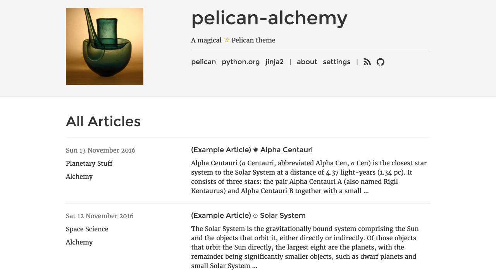

# pelican-alchemy

Alchemy ✨ is a functional, clean, responsive theme for the [Pelican](http://getpelican.com) static site generator. It is heavily inspired by [crowsfoot](http://github.com/porterjamesj/crowsfoot), [clean-blog](https://github.com/BlackrockDigital/startbootstrap-clean-blog), and powered by [Bootstrap](https://github.com/twbs/bootstrap). Pull requests are welcome!

[Demo website](https://nairobilug.github.io/pelican-alchemy/)!

## Screenshot

## Features

- Bootstap 4 (currently v4.0.0-alpha.5)
- Core Pygments [styles](http://pygments.org/demo/)
- External analytics (Google Analytics, Gauges, Piwik)
- External comments (Disqus)
- Font Awesome font icons
- No external dependencies
- No JavaScript (excl. Analytics & Comments)
- Pelican `sitemap.xml` support
- realfavicongenerator [package](http://realfavicongenerator.net/blog/new-favicon-package-less-is-more/) support
- Simple Jinja2 templates

## Installation

First, clone the repo:

    $ git clone git@github.com:nairobilug/pelican-alchemy.git

Then point the `THEME` variable in your Pelican config to the `alchemy` folder:

    THEME = '/path/to/pelican-alchemy/alchemy'

### As a submodule

In your Pelican site:

    $ mkdir themes
    $ git submodule add https://github.com/nairobilug/pelican-alchemy themes/pelican-alchemy

And Pelican config:

    THEME = 'themes/pelican-alchemy/alchemy'

## Settings

Visit the [settings page](https://nairobilug.github.io/pelican-alchemy/pages/settings.html) for examples:

- **SITESUBTITLE**: Subtitle that appears in the header.
- **SITEIMAGE**: Image that appears in the header.
- **DESCRIPTION**: Index HTML head `<meta>` description.
- **LINKS**: A list of tuples (Title, URL) for menu links.
- **ICONS**: A list of tuples (Icon, URL) for icon links.
- **PYGMENTS_STYLE**: Built-in Pygments style for syntax highlighting.
- **HIDE_AUTHORS**: Hide the author(s) of an article - useful for single author sites.
- **RFG_FAVICONS**: Use a [realfavicongenerator](https://realfavicongenerator.net/blog/new-favicon-package-less-is-more/) package.

Others:

- **DISQUS_SITENAME**
- **GAUGES**
- **GOOGLE_ANALYTICS**
- **PIWIK_URL**
- **PIWIK_SITE_ID**

Example Pelican [config](https://github.com/nairobilug/pelican-alchemy/blob/demo/pelicanconf.py) (demo site).

## Tips

### Bootstrap classes

To have Bootstrap classes set for rendered html (`.table`, `.img-fluid` etc), use the [Bootstrapify](https://github.com/ingwinlu/pelican-bootstrapify) plugin.

In your Pelican site:

    $ mkdir plugins
    $ git submodule add https://github.com/ingwinlu/pelican-bootstrapify plugins/pelican-bootstrapify

And Pelican config:

    # http://docs.getpelican.com/en/stable/plugins.html#how-to-use-plugins
    PLUGIN_PATHS = ['plugins']
    PLUGINS = ['pelican-bootstrapify']

    BOOTSTRAPIFY = {
        'table': ['table', 'table-striped', 'table-hover'],
        'img': ['img-fluid'],
        'blockquote': ['blockquote'],
    }

Use `BOOTSTRAPIFY` to pass a `{'css-selector': ['list-of-classes']}` dict to the plugin. Bootstrapify will append `list-of-classes` to all tags that match `css-selector`.

### RFG_FAVICONS

To use the `RFG_FAVICONS` setting, visit [realfavicongenerator.net](https://realfavicongenerator.net/) to generate a site favicon package and download it.

In your Pelican site:

    $ mkdir content/extras
    $ unzip /path/to/favicons.zip -d content/extras

And Pelican config:

    # https://github.com/getpelican/pelican/wiki/Tips-n-Tricks#second-solution-using-static_paths
    STATIC_PATHS = ['extras', 'images']
    EXTRA_PATH_METADATA = {
        'extras/android-chrome-192x192.png': {'path': 'android-chrome-192x192.png'},
        'extras/apple-touch-icon.png': {'path': 'apple-touch-icon.png'},
        'extras/browserconfig.xml': {'path': 'browserconfig.xml'},
        ...
    }

    RFG_FAVICONS = True

Note: `EXTRA_PATH_METADATA` should correspond with the favicon package:

    $ unzip -l /path/to/favicons.zip

### Generate `sitemap.xml`

There is a `sitemap.html` Jinja2 template that can be used to [generate a sitemap](https://github.com/getpelican/pelican/wiki/Tips-n-Tricks#generate-sitemapxml).

In your Pelican config:

    # Default value is ['index', 'tags', 'categories', 'authors', 'archives']
    DIRECT_TEMPLATES = ['index', 'tags', 'categories', 'authors', 'archives', 'sitemap']
    SITEMAP_SAVE_AS = 'sitemap.xml'
