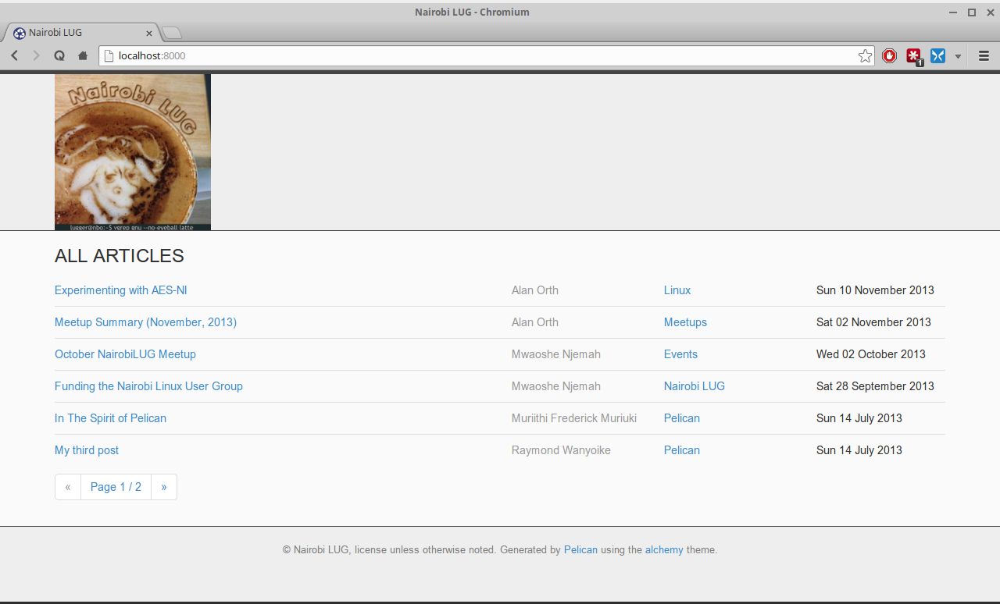

# pelican-alchemy

A theme for the [Pelican](http://getpelican.com) static site generator. A shameless rip off of @porterjamesj's [crowsfoot](http://github.com/porterjamesj/crowsfoot) theme.

## Screenshot

## Installation

`git clone https://github.com/nairobilug/pelican-alchemy.git`

Then set the pelican config variable `THEME` to the `alchemy` folder inside the cloned path.

## Usage

Pelican [documentation](http://docs.getpelican.com/en/latest/)

### Theme Options

| Config                    | Type  | Description       |
| ------------------------- | ----- | ----------------- |
| PROFILE_IMAGE             | URL   | Profile image     |
| SITE_SUBTEXT              | TEXT  | Header subtitle   |
| META_DESCRIPTION          | TEXT  | Meta description  |
| MENU_ITEMS                | DICT  | Menu items        |
| PAGES_ON_MENU             | BOOL  | Pages on the menu |
| SHOW_ARTICLE_AUTHOR       | BOOL  | Show/hide author  |
| LICENSE_URL               | URL   | Footer action     |
| LICENSE_NAME              | TEXT  | Hot footer action |

| Config                    | Type  | Description       |
| ------------------------- | ----- | ----------------- |
| EMAIL_ADDRESS             | EMAIL | Email (mailto)    |
| GITHUB_ADDRESS            | URL   | Github            |
| SO_ADDRESS                | URL   | Stack Overflow    |
| TWITTER_ADDRESS           | URL   | Twitter           |
| FB_ADDRESS                | URL   | Facebook          |

An RSS icon will also appear on the nav if `FEED_ATOM` or `FEED_RSS` is set.

| Config                    | Type  | Description       |
| ------------------------- | ----- | ----------------- |
| DISQUS_SITENAME           | TEXT  | Disqus sitename   |
| GOOGLE_ANALYTICS_ID       | TEXT  | Google analytics  |
| GOOGLE_ANALYTICS_DOMAIN   | TEXT  | Google analytics  |

## Live Demo

[nairobilug.or.ke](http://nairobilug.or.ke)

## License

MIT
